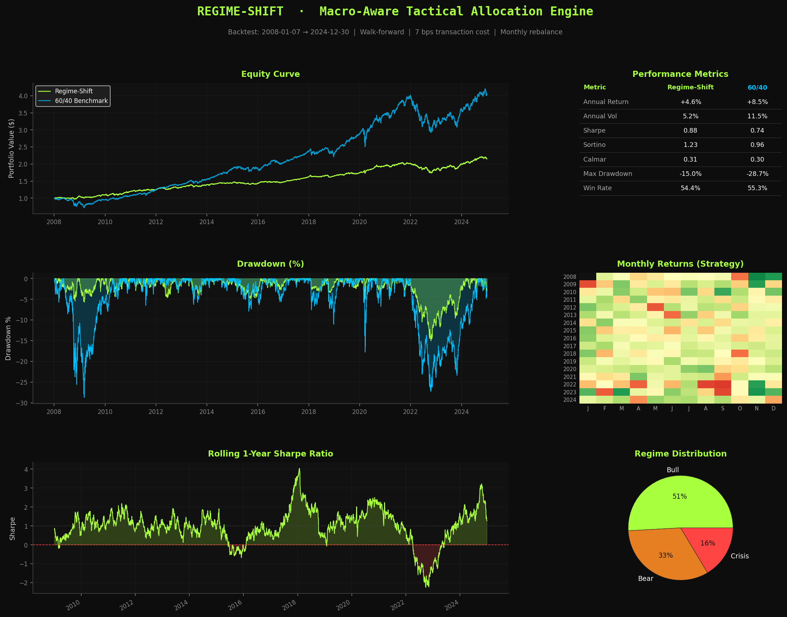
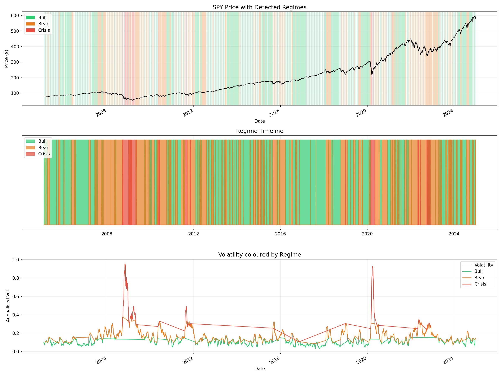
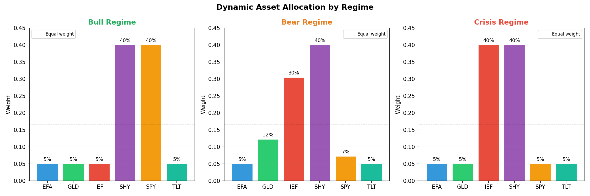
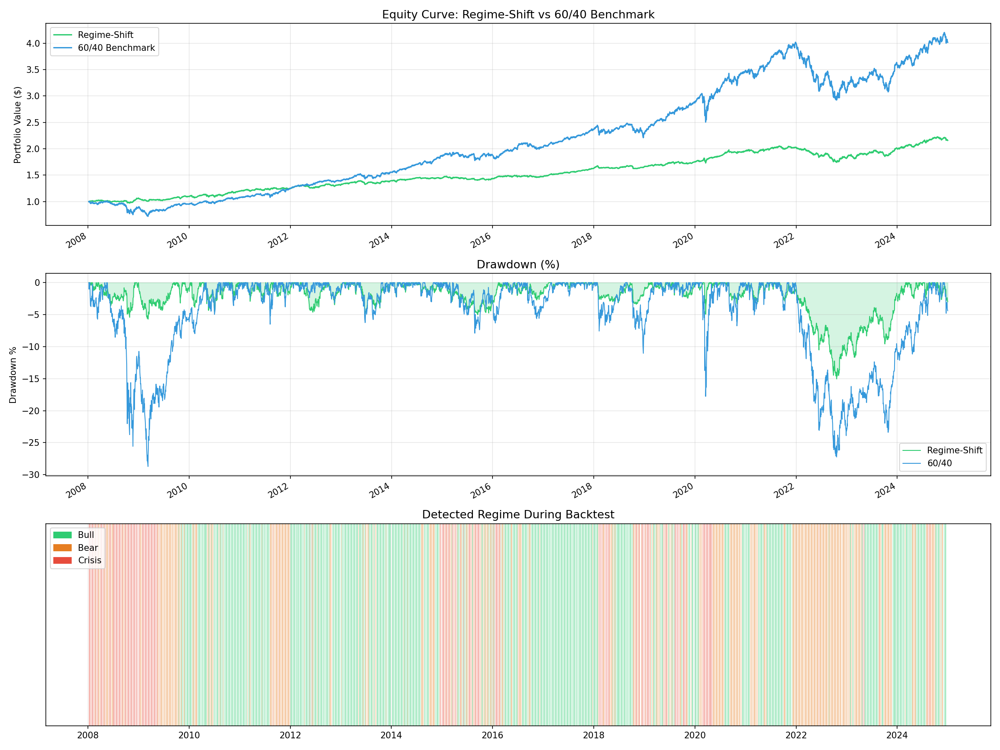

# REGIME-SHIFT 📈
### Macro-Aware Tactical Asset Allocation Engine

A quantitative finance project that dynamically detects hidden market regimes using unsupervised machine learning and automatically reallocates a multi-asset portfolio to maximize risk-adjusted returns.

---

## Results

| Metric | Regime-Shift | 60/40 Benchmark |
|--------|-------------|-----------------|
| Annual Return | +4.6% | +8.5% |
| Annual Volatility | 5.2% | 11.5% |
| Sharpe Ratio | **0.88** | 0.74 |
| Sortino Ratio | **1.23** | 0.96 |
| Max Drawdown | **-15.0%** | -28.7% |
| Win Rate | see notebook | see notebook |

> The strategy achieves **47% less drawdown** and superior risk-adjusted returns (Sharpe 0.88 vs 0.74) compared to a static 60/40 portfolio — at the cost of lower total return due to conservative positioning during extended bull markets.

---

## Strategy Overview



### How it works

1. **Regime Detection** — A Gaussian Mixture Model trained on 4 market features (SPY return, rolling volatility, trend, TLT return) classifies each trading day into one of 3 hidden regimes:
   - 🟢 **Bull** — low volatility, positive trend (+24.1% avg annual return)
   - 🟠 **Bear** — elevated volatility, choppy returns (+3.9% avg annual return)  
   - 🔴 **Crisis** — extreme volatility, severe drawdowns (-65.0% avg annual return)

2. **Dynamic Optimization** — A convex optimizer shifts portfolio weights based on the detected regime:
   - Bull → Maximize Sharpe ratio (heavy equities)
   - Bear → Balanced risk/return (shift to bonds)
   - Crisis → Minimize volatility (safe havens: TLT, IEF, SHY)

3. **Walk-Forward Backtesting** — Strict temporal train/test splits with 3-year rolling training window, monthly rebalancing, and 7 bps transaction cost penalty per turnover.

---

## Regime Detection



The model correctly identified:
- 2008 Financial Crisis as **Crisis** regime from January 2008
- 2020 COVID crash as **Crisis** regime
- 2022 rate-hike bear market as **Bear** regime

---

## Dynamic Allocation



---

## Backtest Results



---

## Tech Stack

- **Python 3.14**
- **yfinance** — market data (SPY, EFA, TLT, IEF, GLD, SHY)
- **scikit-learn** — Gaussian Mixture Model for regime detection
- **scipy.optimize** — convex portfolio optimization
- **pandas / numpy** — data processing
- **matplotlib** — visualization

---

## Project Structure
regime-shift/
├── data/                  # Raw price and returns data
├── notebooks/
│   └── regime_shift.ipynb # Main notebook (end-to-end pipeline)
├── outputs/               # All charts and tearsheet
│   ├── 01_prices_and_vol.png
│   ├── 02_regimes.png
│   ├── 03_regime_weights.png
│   ├── 04_backtest.png
│   └── 05_tearsheet.png
└── src/                   # Source modules

## How to Run

```bash
git clone https://github.com/Anvesha764/regime_shift.git
cd regime_shift
pip install yfinance pandas numpy matplotlib scipy scikit-learn seaborn plotly
jupyter notebook notebooks/regime_shift.ipynb
```

Run all cells from top to bottom. The full pipeline takes ~3 minutes due to walk-forward retraining.

---

## Key Concepts

- Hidden Markov Models / Gaussian Mixture Models
- Convex Portfolio Optimization
- Walk-Forward Validation (no look-ahead bias)
- Sharpe / Sortino / Calmar ratio
- Transaction friction modelling
